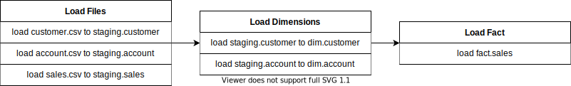
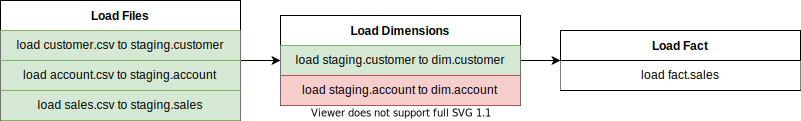
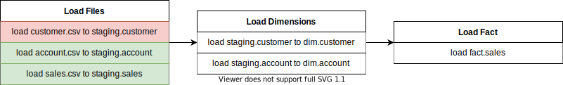
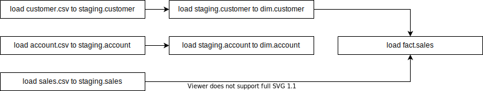
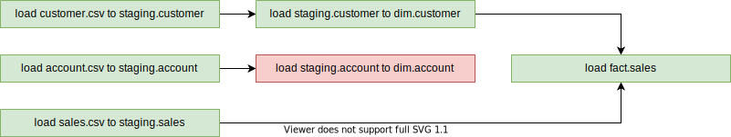

# Object-based Dependencies

The principle of object-based dependencies simplifies dependency management through physical objects instead of physical processes that load or transform our objects. Managing spider webs of dependencies is time-consuming and often confusing. Controlling the timing of data loads, file lands, and more can at times be some of the most time-consuming work.

## The Scenario

Let's imagine we have six processes that load data into our data warehouse. The table below describes each process in our data warehouse:

| Process                               | Source           | Target           |
| ------------------------------------- | ---------------- | ---------------- |
| load customer.csv to staging.customer | customer.csv     | staging.customer |
| load account.csv to staging.account   | account.csv      | staging.account  |
| load sales.csv to staging.sales       | sales.csv        | staging.sales    |
| load staging.customer to dim.customer | staging.customer | dim.customer     |
| load staging.account to dim.account   | staging.account  | dim.account      |
| load fact.sales                       | staging.customer | fact.sales       |
|                                       | staging.sales    | fact.sales       |

From what we can see in the above table, we have three layers of the data warehouse to load. We can easily group these processes to form three batches.

These three batches would then be orchestrated within an orchestration tool such as Apache Airflow or Control-M whereby `Load Files` would run first, followed by `Load Dimensions`, and then finally `Load Fact`.

## The Problems

Two central problems present themselves with the above scenario, the first is around failures or non-starts, and the second is related to the maintenance effort relating to orchestration.

### Failures or Non-Starts

Imagine our batches run, but the process `load staging.account to dim.account` fails during execution. Because our orchestration is sequential and based on the `Load Dimensions` batch, `Load Fact` is never executed even though the target `fact.sales` is not dependant on the `dim.account` object.

This same scenario can occur if one of the files say `customer.csv` never arrives and the process `load customer.csv to staging.customer` fails. The remaining batches and processes are never executed, even though some of them could without any impact on the data warehouse.

### Maintenance

Maintenance tasks are time-consuming and tedious. Ensuring correct orchestration of batches and processes can be very dull and can lead to large spider webs that are hard to read and even harder to maintain.

## The Solution

Echelon resolves the above problems by orchestrating processes based on their source and target object dependencies instead of logical grouping (batches).

Users no longer need to maintain orchestrations between processes as these will now be specified within Echelon itself. To make this work, we need to implement the following:

- Each process should be related to at least one source and one target artefact via the `process_artefact_rel` table.

- Each process artefact relationship should be classified as either required or not required using the `required` field in the `process_artefact_rel` table. This specifies whether the source artefact is necessary to have updated data for the process to run.

- Each process should have its dependency logic set to either `and` or `or` via the `dependency_logic` field in the `process` table. This specifies whether either all or one of the required source artefacts needs to have updated data for the process to run.

Based on the above solution, Echelon will be able to return the processes that can be executed at any point in time. `metacli read:process:run` command has been introduced to provide a list of processes that can be executed.

Relating to the above, our automatic orchestration will now look like the below:

And in case of a failure similar to the one demonstrated above, the remaining unaffected processes can continue to execute, ensuring as much data is delivered to the business user as possible.

